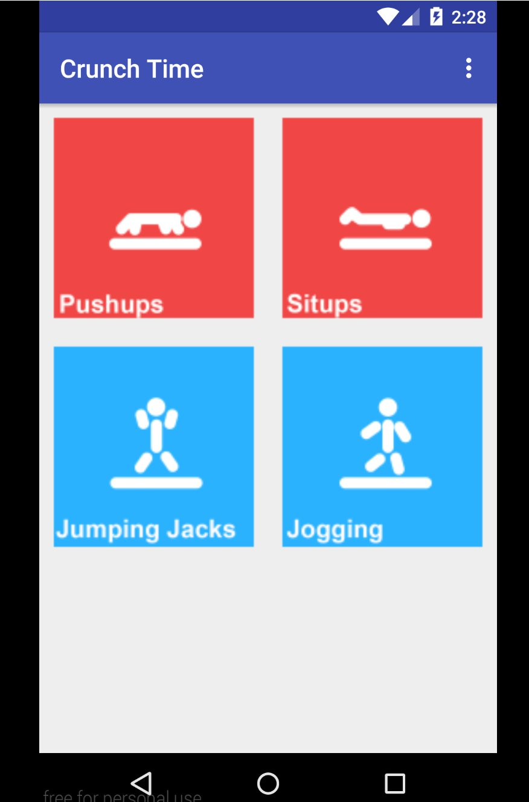
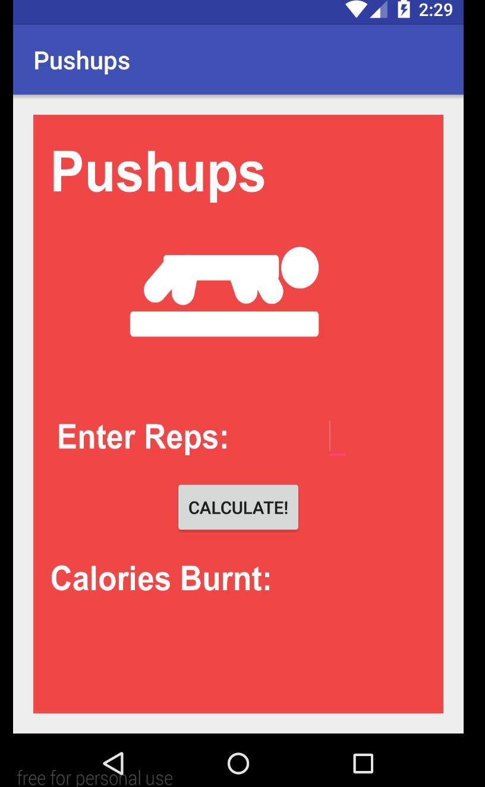
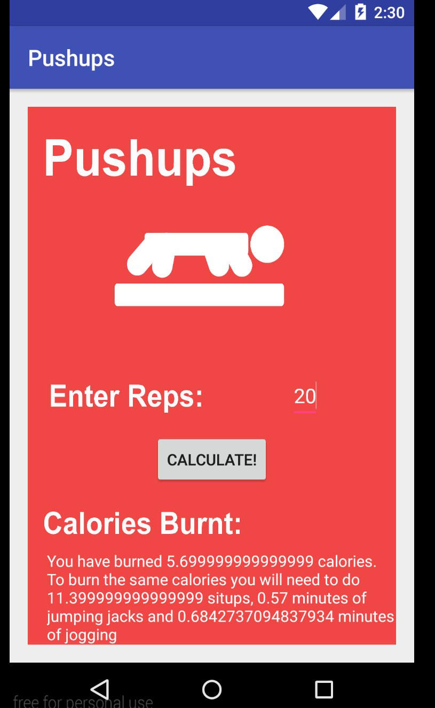
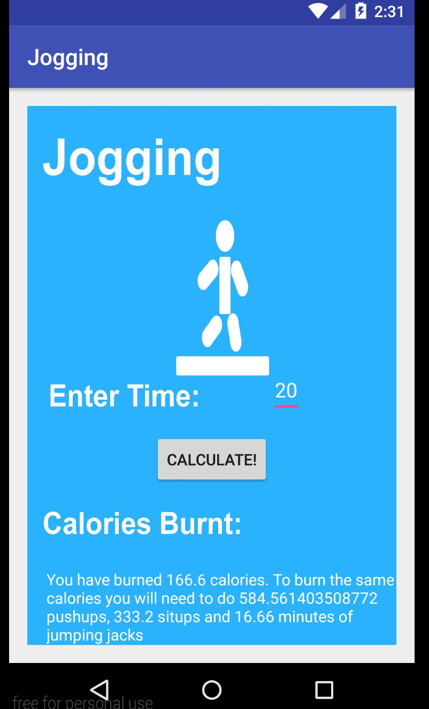

# PROG 01: Crunch Time

Crunch Time is an app used for converting calories. Users can interact with one of four supported excercises. Once
an excercise is selected, the user will be able to input how much of an excercise they did and will be able to see
how many calories they burned. They will also see how much of the other excercises they must do in order to burn
the same amount of calories. The user will then be able to go back and try the other excercises at their leisure.

## Authors

Jeremy Diaz ([j.jeremy.diaz@berkeley.edu](mailto:your_email@berkeley.edu))

## Demo Video

See [CS160 Crunch Time] (http://youtu.be/KlT81qvgBSk?hd=1)

## Screenshots

## Acknowledgments

* Thank you stack exchange.
 

